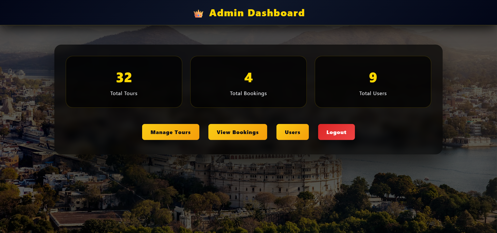
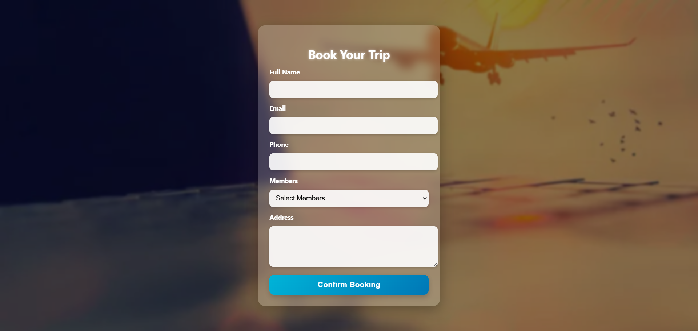

# 🌍 Travel & Tourism Booking System

A **full-stack web application** built using **PHP, MySQL, HTML, CSS, and JavaScript** that allows users to explore and book tours efficiently.  
The system includes **secure user authentication** and a powerful **admin panel** for complete tour and booking management.

---

## ✨ Project Overview

This project follows a **step-by-step user journey**:
1. User **logs in** (or registers if not already registered)
2. User **view tours**
3. User clicks **Book Now**
4. A **booking form** opens
5. After submitting the form, the **tour is successfully booked**

The admin manages tours, users, and bookings from a separate dashboard.

---

## 🧑‍💻 User Flow (How the System Works)

### 👤 User Side:
- User must **login first**
- If the user does not have an account, they can **register**
- After login, the user can:
  - View tours
  - Click **Book Now** on any tour
  - Fill out the booking form
  - Successfully book the tour

### 🛡 Admin Side:
- Admin login to access dashboard
- Admin can:
  - Add new tours
  - Edit existing tours
  - Delete tours
  - View all user bookings
  - Manage users
  - Monitor booking details

---

## 🏖 Key Features

### User Features:
- Secure Login & Registration
- View tour packages
- Book tours through a booking form
- Simple and user-friendly interface

### Admin Features:
- Admin authentication
- Add / Update / Delete tours
- View and manage bookings
- Manage registered users
- Dashboard with booking records

---

## 🌐 Screenshots

### 🏠 Homepage


### 🔐 Admin Panel


### 📝 Booking Form


---

## 🛠 Tech Stack Used

- **Frontend:** HTML, CSS, JavaScript  
- **Backend:** PHP  
- **Database:** MySQL  
- **Server:** XAMPP / Apache  
- **Version Control:** Git & GitHub  

---

## ⚙ Installation & Setup

Follow these steps to run the project locally:

1. Clone the repository:
   ```bash
   git clone https://github.com/Ambikesh-05/Travel-And-Tourism-Booking-System.git
